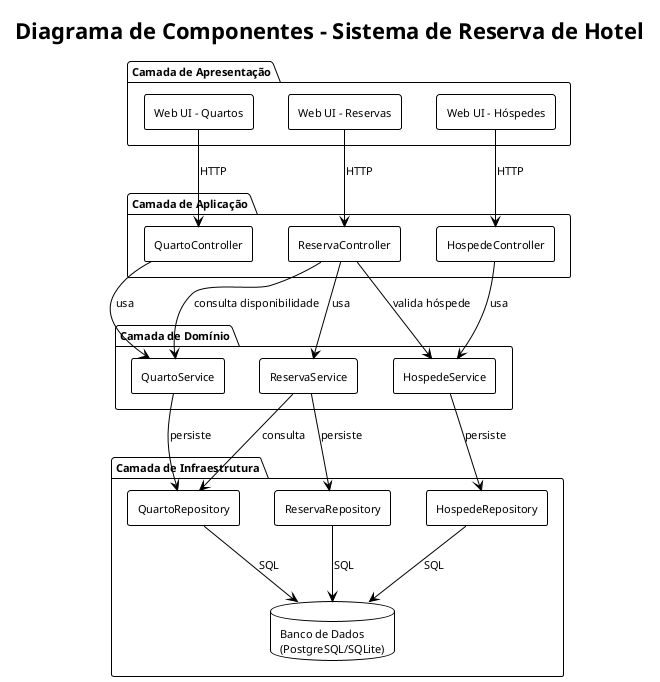
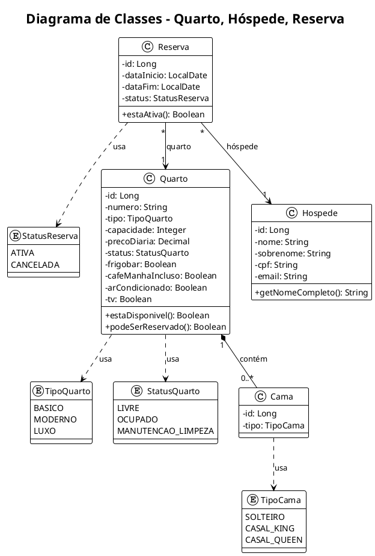

# Proposta de Arquitetura – Sistema de Reserva de Hotel

**Arquivo gerado a partir dos requisitos em `01.listar_requisitos.md`**

---

## 1. Recomendação principal: monolito modular em camadas

Recomenda-se uma **arquitetura monolítica modular em camadas**, alinhada aos requisitos não funcionais:

- **RNF-02.2**: uso em um único hotel, sem necessidade de alta escalabilidade  
- **RNF-05.2**: desenvolvimento modular para manutenção e evolução  
- **RNF-04.1**: aplicação web  
- **RNF-06.1**: evitar perda de dados em operações críticas  

### Por que monolito modular (e não microserviços)?

| Critério | Monolito modular | Microserviços |
|----------|------------------|---------------|
| Escopo | Um único hotel | Múltiplos hotéis, alta escala |
| Complexidade operacional | Baixa | Alta |
| Deployment | Único artefato | Vários serviços independentes |
| Consistência de dados | Transações ACID simples | Eventos/compensação |
| Curva de aprendizado | Menor | Maior |

Para o escopo atual (um hotel, equipe pequena), um monolito modular oferece bom equilíbrio entre simplicidade, manutenção e possibilidade de evolução futura.

### Justificativa: desempenho, escalabilidade e manutenção

#### Desempenho

- **Chamadas locais**: Em um monolito, a comunicação entre domínios (quartos, hóspedes, reservas) ocorre por chamadas de função em memória, sem overhead de rede. Isso é adequado para operações como criar reserva (validar quarto, validar hóspede, persistir) que precisam de várias consultas em sequência.
- **Sem latência de rede inter-serviços**: Em microserviços, cada chamada entre serviços adiciona latência (RTT). Para o RNF-02.1 (resposta em até 3 segundos), o monolito evita essa latência extra.
- **Transações ACID**: Atualizar quarto + reserva na mesma transação é mais rápido e previsível do que coordenar eventos entre serviços.
- **Um único banco**: Menos conexões, menos round-trips, queries mais diretas. Para um único hotel com volume moderado, é suficiente.

#### Escalabilidade

- **Escopo definido (RNF-02.2)**: O requisito indica uso em um único hotel, sem necessidade de alta escalabilidade. Escalar verticalmente (mais CPU/RAM em um servidor) atende bem esse cenário.
- **Padrão de acesso típico**: Recepção do hotel gera dezenas a centenas de requisições por hora, não milhares por segundo. Um único processo com conexão ao banco suporta essa carga.
- **Crescimento futuro**: Se houver crescimento, é possível replicar o monolito (várias instâncias atrás de um load balancer) e usar um banco compartilhado. A migração para microserviços só se justifica em cenários de escala muito maior ou múltiplos hotéis independentes.

#### Manutenção

- **Modularidade (RNF-05.2)**: O monolito modular mantém a separação por domínio (quartos, hóspedes, reservas). Cada módulo tem responsabilidades claras, o que facilita localizar bugs e implementar mudanças sem afetar o resto.
- **Deploy simplificado**: Um único artefato para build, teste e deploy. Menos variáveis, menos pontos de falha, rollback mais simples.
- **Debugging e observabilidade**: Stack traces contínuos, logs em um único fluxo, debugger atravessando todas as camadas. Em microserviços, rastrear uma operação distribuída exige ferramentas adicionais (tracing distribuído).
- **Onboarding**: Nova pessoa na equipe precisa entender um repositório e um fluxo de execução, não vários serviços e suas interfaces.
- **Refatoração gradual**: A estrutura em camadas permite extrair módulos para serviços independentes no futuro, se necessário, sem reescrever tudo.

---

## 2. Visão geral da arquitetura

```
┌─────────────────────────────────────────────────────────────────────┐
│                        APRESENTAÇÃO (Web UI)                          │
│  ┌──────────────┐  ┌──────────────┐  ┌──────────────┐               │
│  │ Quartos      │  │ Hóspedes     │  │ Reservas     │               │
│  │ (listar,     │  │ (listar,     │  │ (listar,     │               │
│  │  cadastrar,  │  │  cadastrar,  │  │  criar,      │               │
│  │  editar)     │  │  editar)     │  │  editar)     │               │
│  └──────────────┘  └──────────────┘  └──────────────┘               │
└─────────────────────────────────────────────────────────────────────┘
                                    │
                                    ▼
┌─────────────────────────────────────────────────────────────────────┐
│                     CAMADA DE APLICAÇÃO (API/Controllers)             │
│  ┌───────────────────────────────────────────────────────────────┐  │
│  │ REST API ou Server-Side Rendering (SSR)                        │  │
│  │ • Rotas /quartos, /hospedes, /reservas                         │  │
│  │ • Validação de entrada (server-side)                           │  │
│  └───────────────────────────────────────────────────────────────┘  │
└─────────────────────────────────────────────────────────────────────┘
                                    │
                                    ▼
┌─────────────────────────────────────────────────────────────────────┐
│                      CAMADA DE DOMÍNIO (Lógica de Negócio)            │
│  ┌──────────────┐  ┌──────────────┐  ┌──────────────┐               │
│  │ Módulo       │  │ Módulo       │  │ Módulo       │               │
│  │ Quartos      │  │ Hóspedes     │  │ Reservas     │               │
│  │              │  │              │  │              │               │
│  │ • Quarto     │  │ • Hóspede    │  │ • Reserva    │               │
│  │ • Cama       │  │ • Validação  │  │ • Regras de  │               │
│  │ • Disponib.  │  │   CPF/Email  │  │   disponib.  │               │
│  └──────────────┘  └──────────────┘  └──────────────┘               │
└─────────────────────────────────────────────────────────────────────┘
                                    │
                                    ▼
┌─────────────────────────────────────────────────────────────────────┐
│                    CAMADA DE INFRAESTRUTURA                           │
│  ┌──────────────────┐  ┌──────────────────┐                         │
│  │ Repositórios     │  │ Banco de dados   │                         │
│  │ (QuartoRepo,     │  │ (PostgreSQL ou   │                         │
│  │  HospedeRepo,    │  │  SQLite para     │                         │
│  │  ReservaRepo)    │  │  dev)            │                         │
│  └──────────────────┘  └──────────────────┘                         │
└─────────────────────────────────────────────────────────────────────┘
```

---

## 3. Camadas e responsabilidades

### 3.1 Camada de apresentação (frontend)

- **Responsabilidade**: Interface web responsiva, paleta verde/azul (RNF-01), componentes modernos (RNF-01.3), consistência visual (RNF-01.4).
- **Responsabilidades**:
  - Formulários de cadastro/edição (quartos, hóspedes, reservas).
  - Listagens com tabelas e chips de disponibilidade.
  - Validação client-side (RNF-06.2) para feedback imediato.
  - Chamadas HTTP à API ou consumo de views SSR.
- **Sugestão tecnológica**: React, Vue ou Svelte, ou SSR (Next.js, Nuxt) com Tailwind CSS.

### 3.2 Camada de aplicação (API / Controllers)

- **Responsabilidade**: Orquestrar o fluxo das requisições, validar entradas e delegar ao domínio.
- **Responsabilidades**:
  - Rotas REST (ex.: `GET/POST/PUT /quartos`, `/hospedes`, `/reservas`).
  - Validação server-side (RNF-06.2).
  - Conversão DTO ↔ entidades de domínio.
  - Autenticação (quando requisitada nos casos de uso).
- **Sugestão tecnológica**: Express.js, Fastify, NestJS ou equivalente em outra stack.

### 3.3 Camada de domínio (lógica de negócio)

- **Responsabilidade**: Centralizar regras de negócio (RF-04).
- **Módulos**:
  1. **Quartos**
     - Unicidade de número (RF-04.5).
     - Disponibilidade: Ocupado, Livre, Manutenção e Limpeza.
  2. **Hóspedes**
     - Validação de CPF (formato e unicidade – RF-04.3).
     - Validação de e-mail (RF-04.4).
  3. **Reservas**
     - Impedir reserva de quarto ocupado ou em manutenção/limpeza (RF-04.1).
     - Atualizar disponibilidade ao criar/alterar/cancelar reserva (RF-04.2).
- **Sugestão**: Organizar em serviços de domínio (ex.: `ReservaService`, `QuartoService`) e entidades.

### 3.4 Camada de infraestrutura

- **Responsabilidade**: Persistência, acesso a dados externos.
- **Componentes**:
  - **Repositórios**: abstrações para Quarto, Hóspede, Reserva.
  - **Banco de dados**: relacional (PostgreSQL em produção, SQLite em desenvolvimento).
  - **Tratamento de CPF**: mascaramento ou criptografia conforme RNF-03.1.
- **Consistência**: uso de transações para operações que alteram quarto e reserva em conjunto (RNF-06.1).

---

## 4. Diagrama de componentes

### 4.1 Diagrama UML (PlantUML)



### 4.2 Diagrama em notação textual (ASCII UML)

```
┌─────────────────────────────────────────────────────────────────────────────────┐
│                           CAMADA DE APRESENTAÇÃO                                  │
│  ┌─────────────┐   ┌─────────────┐   ┌─────────────┐                            │
│  │ Web UI      │   │ Web UI      │   │ Web UI      │                            │
│  │ Quartos     │   │ Hóspedes    │   │ Reservas    │                            │
│  └──────┬──────┘   └──────┬──────┘   └──────┬──────┘                            │
└─────────┼─────────────────┼─────────────────┼──────────────────────────────────┘
          │ HTTP            │ HTTP            │ HTTP
          ▼                 ▼                 ▼
┌─────────────────────────────────────────────────────────────────────────────────┐
│                           CAMADA DE APLICAÇÃO                                     │
│  ┌─────────────┐   ┌─────────────┐   ┌─────────────┐                            │
│  │ Quarto      │   │ Hospede     │   │ Reserva     │                            │
│  │ Controller  │   │ Controller  │   │ Controller  │                            │
│  └──────┬──────┘   └──────┬──────┘   └──────┬──────┘                            │
└─────────┼─────────────────┼─────────────────┼──────────────────────────────────┘
          │ usa             │ usa             │ usa
          ▼                 ▼                 ▼
┌─────────────────────────────────────────────────────────────────────────────────┐
│                            CAMADA DE DOMÍNIO                                      │
│  ┌─────────────┐   ┌─────────────┐   ┌─────────────┐                            │
│  │ Quarto      │   │ Hospede     │   │ Reserva     │                            │
│  │ Service     │   │ Service     │   │ Service     │◄─────────────┐              │
│  └──────┬──────┘   └──────┬──────┘   └──────┬──────┘             │              │
│         ▲                 ▲                 │                     │              │
│         └─────────────────┴─────────────────┘                     │ consulta     │
│                   (ReservaService consulta Quarto e Hospede)       │ disponib.   │
└─────────┼─────────────────┼─────────────────┼─────────────────────┘              │
          │ persiste        │ persiste        │ persiste                           │
          ▼                 ▼                 ▼                                    │
┌─────────────────────────────────────────────────────────────────────────────────┐
│                         CAMADA DE INFRAESTRUTURA                                  │
│  ┌─────────────┐   ┌─────────────┐   ┌─────────────┐   ┌────────────────────┐   │
│  │ Quarto      │   │ Hospede     │   │ Reserva     │   │ Banco de Dados     │   │
│  │ Repository  │   │ Repository  │   │ Repository  │   │ (PostgreSQL/SQLite)│   │
│  └──────┬──────┘   └──────┬──────┘   └──────┬──────┘   └─────────▲──────────┘   │
│         └─────────────────┴─────────────────┴───────────────────┘              │
│                                    SQL                                           │
└─────────────────────────────────────────────────────────────────────────────────┘
```

### 4.3 Interfaces e dependências

| Componente | Interface (fornecida) | Depende de |
|------------|----------------------|------------|
| QuartoController | REST: GET/POST/PUT /quartos | QuartoService |
| HospedeController | REST: GET/POST/PUT /hospedes | HospedeService |
| ReservaController | REST: GET/POST/PUT /reservas | ReservaService, QuartoService, HospedeService |
| QuartoService | listar(), cadastrar(), editar(), alterarStatus(), obterDisponibilidade() | IQuartoRepository |
| HospedeService | listar(), cadastrar(), editar() | IHospedeRepository |
| ReservaService | listar(), criar(), editar(), cancelar() | IReservaRepository, IQuartoRepository |
| QuartoRepository | implementa IQuartoRepository | Banco de Dados |
| HospedeRepository | implementa IHospedeRepository | Banco de Dados |
| ReservaRepository | implementa IReservaRepository | Banco de Dados |

---

## 5. Estrutura de módulos sugerida

```
src/
├── presentation/           # ou frontend/ (se SPA separada)
│   ├── pages/
│   │   ├── quartos/
│   │   ├── hospedes/
│   │   └── reservas/
│   └── components/
│
├── application/            # Controllers, DTOs, rotas
│   ├── quartos/
│   ├── hospedes/
│   └── reservas/
│
├── domain/                 # Lógica de negócio
│   ├── quartos/
│   │   ├── entities/
│   │   ├── services/
│   │   └── repositories/   # interfaces
│   ├── hospedes/
│   └── reservas/
│
└── infrastructure/         # Implementações
    ├── database/
    ├── repositories/
    └── validators/         # CPF, e-mail
```

---

## 6. Modelo de dados simplificado

```
┌──────────────┐     ┌──────────────┐     ┌──────────────┐
│   Quarto     │     │   Hóspede    │     │   Reserva    │
├──────────────┤     ├──────────────┤     ├──────────────┤
│ id           │     │ id           │     │ id           │
│ numero       │◄────│ nome         │────►│ quarto_id    │
│ tipo         │     │ sobrenome    │     │ hospede_id   │
│ capacidade   │     │ cpf          │     │ data_inicio  │
│ preco_diaria │     │ email        │     │ data_fim     │
│ status       │     └──────────────┘     │ status       │
│ ...          │                          └──────────────┘
└──────────────┘
       │
       │ 1:N
       ▼
┌──────────────┐
│   Cama       │
├──────────────┤
│ id           │
│ quarto_id    │
│ tipo         │
└──────────────┘
```

---

## 7. Diagrama de classes principal

### 7.1 Diagrama UML (PlantUML)



### 7.2 Diagrama em notação textual (ASCII UML)

```
┌─────────────────────┐     ┌─────────────────────┐     ┌─────────────────────┐
│ <<enumeration>>     │     │ <<enumeration>>     │     │ <<enumeration>>     │
│ TipoQuarto          │     │ StatusQuarto        │     │ TipoCama            │
├─────────────────────┤     ├─────────────────────┤     ├─────────────────────┤
│ BASICO              │     │ LIVRE               │     │ SOLTEIRO            │
│ MODERNO             │     │ OCUPADO             │     │ CASAL_KING          │
│ LUXO                │     │ MANUTENCAO_LIMPEZA  │     │ CASAL_QUEEN         │
└──────────▲──────────┘     └──────────▲──────────┘     └──────────▲──────────┘
           │                          │                            │
           └──────────────────────────┼────────────────────────────┘
                                      │
┌─────────────────────────────────────┼─────────────────────────────────────────┐
│ Quarto                              │                                         │
├─────────────────────────────────────┴─────────────────────────────────────────┤
│ - id: Long                                                                    │
│ - numero: String                                                              │
│ - tipo: TipoQuarto                                                            │
│ - capacidade: Integer                                                         │
│ - precoDiaria: Decimal                                                        │
│ - status: StatusQuarto                                                        │
│ - frigobar: Boolean                                                           │
│ - cafeManhaIncluso: Boolean                                                   │
│ - arCondicionado: Boolean                                                     │
│ - tv: Boolean                                                                 │
├───────────────────────────────────────────────────────────────────────────────┤
│ + estaDisponivel(): Boolean                                                   │
│ + podeSerReservado(): Boolean                                                 │
└───────┬─────────────────────────────────────────────────────────┬─────────────┘
        │ 1                                                       │ *
        │ *-- contém                                              │
        ▼                                                         │
┌───────────────────┐                                             │
│ Cama              │                                             │
├───────────────────┤                                             │
│ - id: Long        │                                             │
│ - tipo: TipoCama  │                                             │
└───────────────────┘                                             │
                                                                  │
┌─────────────────────┐                                           │
│ <<enumeration>>     │                                           │
│ StatusReserva       │                                           │
├─────────────────────┤                                           │
│ ATIVA               │                                           │
│ CANCELADA           │                                           │
└──────────▲──────────┘                                           │
           │                                                      │
           │ usa                                                  │
           │                                                      │
┌──────────┴──────────────────────────────────────────────────────┴─────────────┐
│ Reserva                                                                      │
├──────────────────────────────────────────────────────────────────────────────┤
│ - id: Long                                                                    │
│ - dataInicio: LocalDate                                                       │
│ - dataFim: LocalDate                                                          │
│ - status: StatusReserva                                                       │
├──────────────────────────────────────────────────────────────────────────────┤
│ + estaAtiva(): Boolean                                                        │
└───────┬──────────────────────────────────┬───────────────────────────────────┘
        │ *                                 │ *
        │ quarto                            │ hóspede
        ▼                                  ▼
┌───────────────────┐            ┌───────────────────┐
│ Quarto            │            │ Hospede           │
│ (referenciado)    │            ├───────────────────┤
└───────────────────┘            │ - id: Long        │
                                 │ - nome: String    │
                                 │ - sobrenome: String│
                                 │ - cpf: String     │
                                 │ - email: String   │
                                 ├───────────────────┤
                                 │ + getNomeCompleto(): String│
                                 └───────────────────┘
```

### 7.3 Resumo das classes e multiplicidades

| Classe | Descrição | Relacionamentos |
|--------|-----------|-----------------|
| **Quarto** | Representa um quarto do hotel | Contém 0..* Cama; referenciado por 0..* Reserva |
| **Cama** | Representa uma cama no quarto | Pertence a 1 Quarto |
| **Hospede** | Representa um hóspede cadastrado | Referenciado por 0..* Reserva |
| **Reserva** | Associa quarto e hóspede em um período | Referencia 1 Quarto e 1 Hospede |

---

## 8. Evolução futura: quando considerar microserviços

Se o escopo evoluir para:

- múltiplos hotéis ou cadeias;
- necessidade de escalabilidade horizontal por domínio;
- equipes independentes por área (quartos, reservas, hóspedes);

pode-se evoluir para microserviços por domínio, por exemplo:

- **Quartos**: gestão de inventário e disponibilidade.
- **Hóspedes**: cadastro e fidelidade.
- **Reservas**: orquestração de reservas e integrações.

A arquitetura modular facilita essa migração gradual.

---

## 9. Resumo da proposta

| Aspecto | Decisão |
|---------|---------|
| **Estilo arquitetural** | Monolito modular em camadas |
| **Camadas** | Apresentação, Aplicação, Domínio, Infraestrutura |
| **Módulos de domínio** | Quartos, Hóspedes, Reservas |
| **Banco de dados** | Relacional (PostgreSQL/SQLite) |
| **Comunicação** | REST API ou SSR |
| **Escalabilidade** | Vertical (adequada ao escopo atual) |

Esta proposta está alinhada aos requisitos funcionais e não funcionais do documento de requisitos e favorece manutenção, evolução e possível migração futura para uma arquitetura mais distribuída.
